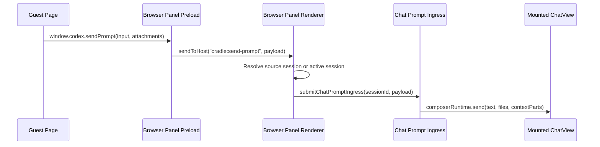

<!--
Input: Browser Panel implementation, desktop webview lifecycle, browser-use plugin architecture, and Chat prompt ingress.
Output: Browser Panel webview bridge ownership and API contract.
Position: docs/specs/browser-panel-webview-bridge.md
-->

# Browser Panel Webview Bridge

## 目标

Browser Panel 的目标是成为 Cradle desktop 里的右侧轻量浏览器，而不是一个安全优先的隔离 artifact viewer。它需要支持普通网页的多页面使用方式，同时允许页面主动把 prompt、图片或文件附件发回左侧 Chat。

当前实现的核心能力是：

- Desktop host 给 Browser Panel webview 安装 guest preload。
- Guest page 看到 `window.codex.sendPrompt(...)`。
- Browser Panel renderer 接收 webview `sendToHost` 消息。
- Chat feature 暴露 session-scoped prompt ingress registry。
- Browser Panel popup / `window.open` 进入 Browser Panel tab，而不是 native Electron popup。
- `browser-use` plugin 继续通过 plugin SDK 观察 webview creation 并执行 CDP automation。

## Owner

| Area | Owner | Namespace |
| --- | --- | --- |
| Webview lifecycle | Desktop host | `apps/desktop/src/main` |
| Guest preload | Desktop preload | `apps/desktop/src/preload/browser-panel.ts` |
| Browser tabs and host message ingestion | Browser feature | `apps/web/src/features/browser` |
| Chat prompt submission | Chat feature | `apps/web/src/features/chat/prompt-ingress.ts` |
| Agent browser automation | Browser Use plugin | `plugins/browser-use` |

`browser-use` 不是 `sendPrompt` 的 owner。它可以读取和自动化 Browser Panel webview，但不应该定义 page-to-chat API，也不应该把 `window.codex` 当作自己的 plugin surface。

## Runtime Flow



## Page API

Guest pages can call:

```ts
await window.codex?.sendPrompt('Improve this page.')
```

Object input:

```ts
await window.codex?.sendPrompt({
  text: 'Review this design.',
  attachments: [
    {
      filename: 'screen.png',
      mediaType: 'image/png',
      url: 'data:image/png;base64,...',
    },
  ],
})
```

Equivalent aliases:

- `text` and `prompt` both map to prompt text.
- `attachments` and `files` both map to attachment inputs.
- Attachment inputs may be string URLs, data URLs, object payloads, `Blob`, or `File`.

The preload normalizes attachments to:

```ts
interface BrowserPanelPromptAttachment {
  filename?: string
  mediaType?: string
  url: string
}
```

The renderer converts them to AI SDK `FileUIPart[]` before entering Chat.

## Session Routing

When a page calls `sendPrompt`, Browser Panel chooses the destination session in this order:

1. The browser tab source session, if the tab was created from a chat session.
2. The current active chat session, if the tab has no source session.
3. No-op with a warning if no target session or mounted ChatView handler exists.

This is intentionally session-scoped. Browser Panel does not own chat state, message persistence, or provider runtime semantics.

## Popup Routing

Browser Panel webviews set `allowpopups` and the desktop host installs `setWindowOpenHandler`. Native popup creation is denied and the URL is sent to the renderer through `browser-panel:open-url`. The renderer opens Browser Panel and creates an owner-scoped tab for the active Cradle tab.

This avoids the common failure mode where external sites jump into unmanaged Electron windows or appear to reload the current Browser Panel tab unexpectedly.

## Browser Use Boundary

The Browser Use plugin path is:

1. Desktop plugin activates through plugin loader.
2. Plugin registers `ctx.webviews.onCreated(...)`.
3. Desktop host calls `notifyWebviewCreated(webContents, tabId)` after attaching a webview.
4. Plugin receives a `DesktopWebview` facade and attaches CDP.
5. MCP tools issue navigation, screenshot, click, type, DOM snapshot, eval, and tab commands.

This is agent-to-browser automation. It is separate from page-to-chat prompt ingress.

## Verification

Focused automated checks:

```bash
pnpm --filter @cradle/web exec vitest run src/features/browser/browser-panel.test.tsx src/store/browser-panel.test.ts src/features/chat/prompt-ingress.test.ts --environment jsdom --reporter=dot
pnpm --filter @cradle/desktop exec tsc --noEmit -p tsconfig.node.json --pretty false
pnpm --filter @cradle/desktop exec vitest run src/main/desktop-assets.test.ts --reporter=dot
```

Manual desktop smoke:

1. Start Cradle desktop.
2. Open a chat session.
3. Open Browser Panel and navigate to any page.
4. Run `window.codex?.sendPrompt('Summarize this page.')` inside the guest page.
5. Confirm the left Chat sends the prompt.
6. Run `window.open('https://example.com')` inside the guest page.
7. Confirm Browser Panel opens a new tab instead of a native popup.

## Non-goals

- Do not expose raw Electron or Node APIs to guest pages.
- Do not move Chat submission semantics into `plugins/browser-use`.
- Do not write to plugin-owned or provider-owned namespaces from Browser Panel.
- Do not make `window.codex` a generic web runtime API.
